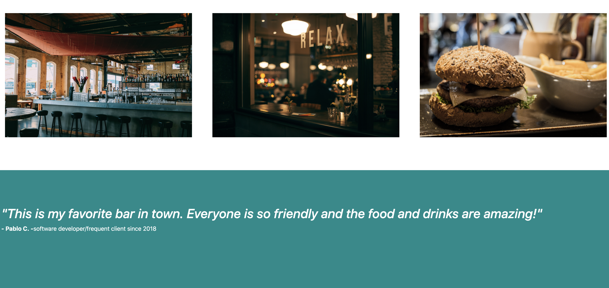
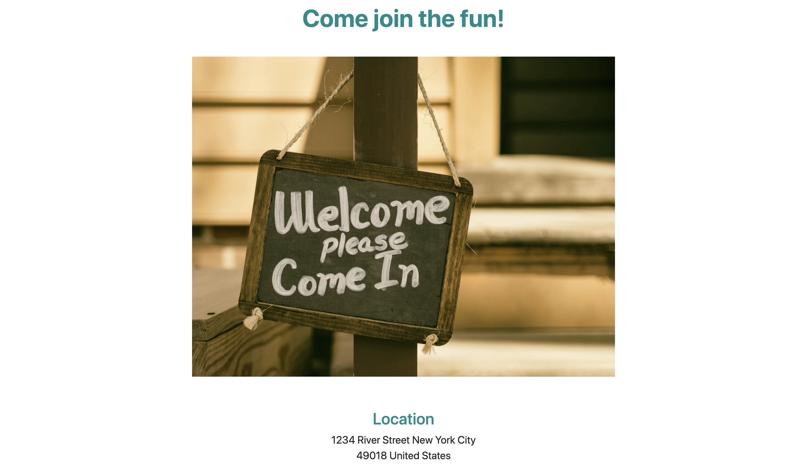

## Details

In this project, I've built my own bar page that will dynamically respond as users adjust the size of their screen.

**br-club** ​is a responsive design project by [codeacademy](https://www.codecademy.com/).

#### Languages
 * HTML
 * JavaScript
 * CSS

 #### CSS framework
 * Bootstrap 4.5

#### Images

